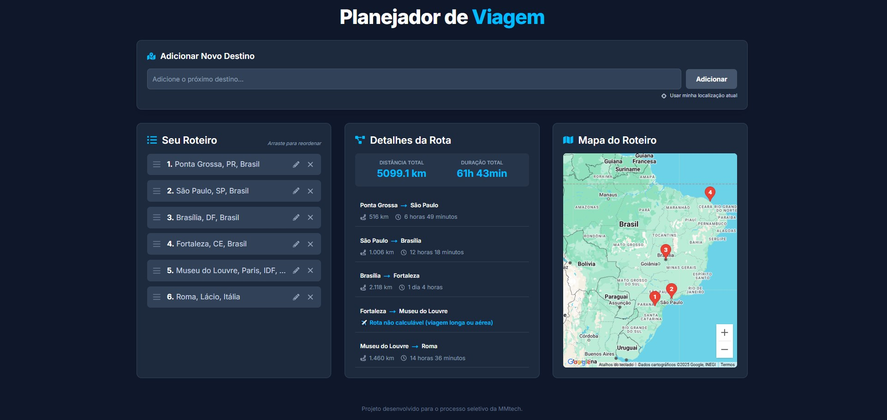

# ✈️ Planejador de Viagem - Desafio MMTech

Este projeto é um sistema completo de planejamento de rotas de viagem. A aplicação permite que os usuários criem, visualizem, editem e organizem uma lista de destinos, calculando automaticamente as distâncias e durações de cada trecho da viagem.

O sistema foi construído com foco em uma arquitetura moderna e componentizada, e em uma experiência de usuário limpa, interativa e totalmente responsiva.

### 📸 Screenshot da Aplicação



---

## ✨ Funcionalidades

- **CRUD Completo de Destinos:** Adicione, leia, edite e exclua destinos do roteiro.
- **Busca Inteligente com Autocomplete:** Campo de busca integrado com a API do Google Places, fornecendo sugestões precisas de locais do mundo todo.
- **Reordenação com Drag and Drop:** Organize o roteiro de forma intuitiva arrastando os itens.
- **Cálculo de Rota Dinâmico:** Integração com a API do Google Maps Directions para calcular a distância e a duração de cada trecho da viagem.
- **Tratamento de Rotas Longas:** O sistema identifica trechos intercontinentais ou muito longos e exibe um feedback visual apropriado em vez de um erro.
- **Mapa Interativo:** Visualização de todos os destinos como marcadores em um mapa com zoom dinâmico.
- **Localização Atual do Usuário:** Funcionalidade para adicionar o ponto de partida baseado na geolocalização atual do usuário.
- **Interface e UX Modernas:**
  - Design responsivo com tema escuro.
  - Notificações "Toast" para feedback de ações (sucesso, erro).
  - Modais de confirmação para ações de exclusão e edição.
  - Validações de formulário e de lógica de negócios (limite de destinos, itens duplicados).
- **Containerização com Docker:** A aplicação é totalmente dockerizada para um ambiente de produção consistente e de fácil execução.

## 🚀 Tecnologias Utilizadas

<p align="center">
  
  
  
  
  
  
  
</p>

- **Framework Principal:** Next.js
- **Frontend:** React
- **Linguagem:** TypeScript
- **Estilização:** Tailwind CSS
- **Backend:** Node.js (ambiente do Next.js com API Routes)
- **Banco de Dados:** NeDB (baseado em arquivo)
- **APIs Externas:** Google Maps Platform (Directions, Places, Geocoding, Maps JavaScript)
- **Interatividade:**
  - `dnd-kit` para Drag and Drop
  - `Headless UI` para Modais Acessíveis
  - `react-hot-toast` para Notificações
  - `react-icons` para iconografia

### Ferramentas de Desenvolvimento

- **Versionamento:** Git & GitHub
- **Testes de API:** Postman
- **Containerização:** Docker

## 📂 Estrutura do Projeto

A estrutura de pastas principal do projeto foi organizada para separar responsabilidades, seguindo as melhores práticas do Next.js.

```
mmtech-trip-planner/
├── src/
│   ├── app/
│   │   ├── api/
│   │   │   ├── destinos/       # API para CRUD de destinos
│   │   │   ├── reorder/        # API para reordenar
│   │   │   └── rota/           # API para cálculo de rota
│   │   └── planejador/
│   │       └── page.tsx        # Componente principal da página
│   ├── components/
│   │   ├── planner/            # Componentes específicos da página do planejador
│   │   └── ConfirmationModal.tsx
│   ├── lib/
│   │   ├── database.ts         # Configuração do Singleton do NeDB
│   │   └── formatters.ts       # Funções de formatação
│   └── types/
│       └── index.ts            # Interfaces e tipos globais
├── public/
├── Dockerfile                  # Receita para a imagem de produção
├── next.config.mjs
├── package.json
└── tailwind.config.ts
```

## ⚙️ Como Executar o Projeto

### Pré-requisitos

Antes de começar, você vai precisar ter instalado em sua máquina:

- [Node.js (v18 ou superior)](https://nodejs.org/en/)
- [Docker Desktop](https://www.docker.com/products/docker-desktop/)

### Configuração Obrigatória: Chave da API Google Maps

1.  **Acesse o [Google Cloud Platform](https://console.cloud.google.com/)** e crie ou selecione um projeto.
2.  **Ative o Faturamento** no seu projeto (o Google oferece um amplo nível gratuito que não será excedido por este projeto).
3.  No menu "APIs e Serviços", **habilite as seguintes APIs**:
    - `Directions API`
    - `Places API`
    - `Geocoding API`
    - `Maps JavaScript API`
4.  Em "Credenciais", crie uma **Chave de API**.
5.  Crie um arquivo chamado `.env.local` na raiz do projeto e cole sua chave nele, como no exemplo abaixo.

### Executando com Docker

1. **Abra o Docker Desktop** e certifique-se de que ele está em execução.

2. **Clone o repositório:**

   ```bash
   git clone https://github.com/LeoMulinari/mmtech-trip-planner.git
   cd mmtech-trip-planner
   ```

3. **Crie o arquivo `.env.local`** na raiz do projeto com sua chave:

   ```
   NEXT_PUBLIC_Maps_API_KEY="SUA_CHAVE_DE_API_AQUI"
   ```

4. **Construa a imagem Docker:**
   Este comando injeta a chave de API de forma segura durante o processo de build.

   ```bash
   docker build --build-arg NEXT_PUBLIC_Maps_API_KEY="SUA_CHAVE_DE_API_AQUI" -t planejador-viagem .
   ```

5. **Execute o contêiner:**

   ```bash
   docker run -p 3000:3000 -d --name meu-planejador planejador-viagem
   ```

6. Abra `http://localhost:3000` no seu navegador e aproveite!

## 🔮 Melhorias Futuras

Embora o projeto cumpra todos os requisitos, algumas funcionalidades poderiam ser adicionadas no futuro para transformá-lo em um produto ainda mais completo:

- **Sistema de Contas de Usuário:** Permitir que cada usuário salve seus próprios roteiros de forma privada.
- **Salvar e Carregar Roteiros:** Funcionalidade para nomear e salvar múltiplos roteiros.

---

Desenvolvido por **Leonardo Mulinari**
